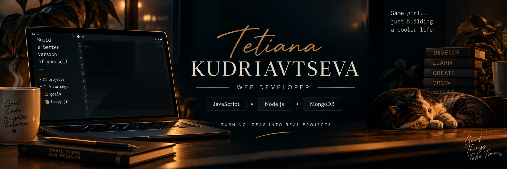
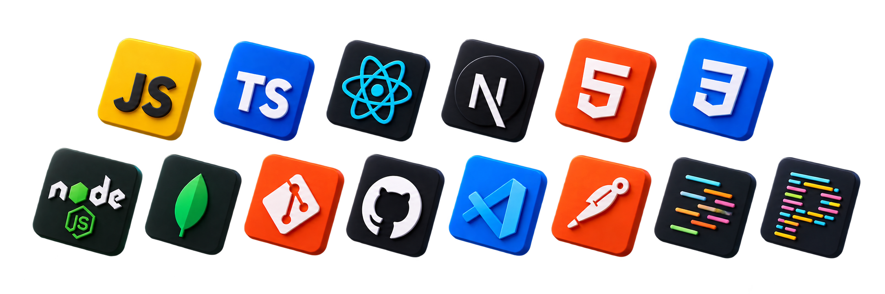

<!-- ==================== HERO ==================== -->

  

 

 

<!-- ==================== INTRO ==================== -->

<h1 align="center">Tetiana Kudriavtseva</h1>

<h3 align="center">
  WEB DEVELOPER
</h3>

  JavaScript · TypeScript · React · Next.js · Node.js

  Turning ideas into real projects.

 

<!-- ==================== ABOUT ==================== -->

## 👩‍💻 About Me

I'm a Web Developer focused on building modern,
responsive and user-friendly web applications.

- 💻 Developing my skills in <strong>JavaScript, TypeScript, React, Next.js and Node.js</strong>
- 🚀 Building real-world projects and strengthening my backend skills
- 🧩 Interested in clean architecture, reusable components and scalable applications
- 📚 Constantly learning and exploring new technologies
- 🎯 Growing towards Full-Stack Development

 

<!-- ==================== TECH STACK ==================== -->

## 🛠️ Tech Stack

  

<!-- ==================== PROJECTS ==================== -->

## 🚀 Featured Projects

### ⚡ EnerHome

**Production-like Next.js landing page**

Responsive landing page for an energy independence company with an interactive quiz, SEO optimization and structured data.

`Next.js` · `React` · `TypeScript`

&nbsp;&nbsp;

### 🐾 Home Friends

**Team Front-End project**

Responsive web application for finding and adopting pets, developed as a team project. I contributed to the development of one of the main website sections.

`JavaScript` · `HTML5` · `CSS3` · `Vite` · `Axios`

&nbsp;&nbsp;

---

### 🧠 Math Trainer

**Interactive math quiz application**

Timed quizzes, answer validation, score calculation and result tracking.

`React` · `TypeScript` · `Vite`

&nbsp;&nbsp;

<!-- ==================== GITHUB ==================== -->

## 📊 GitHub Stats

  

<!-- ==================== CONNECT ==================== -->

## 📫 Let's Connect

  
  &nbsp;
  
  &nbsp;
  

 

  <i>Building. Learning. Growing.</i> ✨

