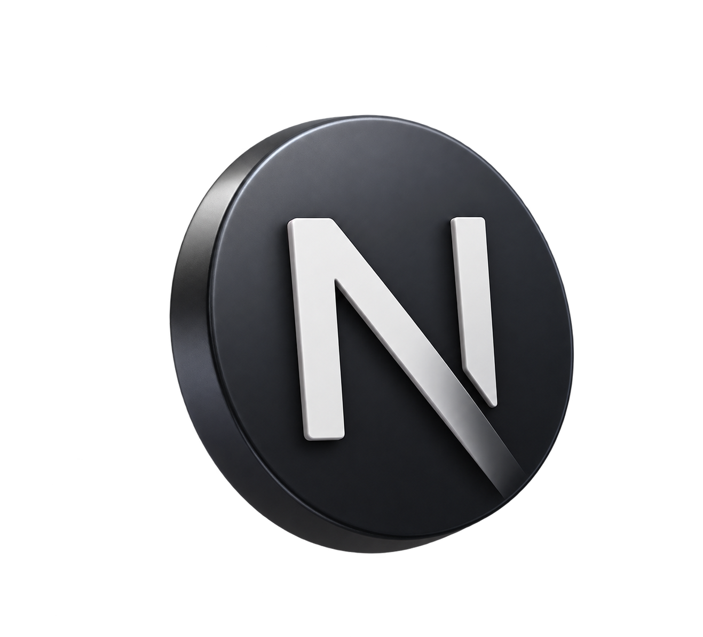
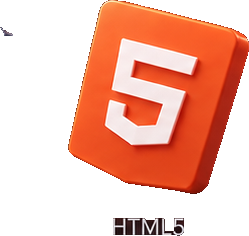
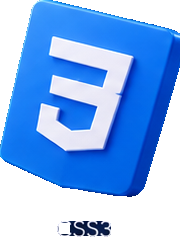
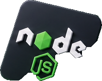
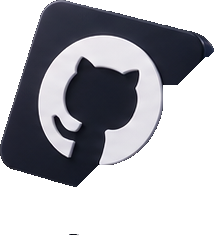
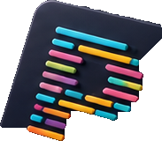

<!-- ==================== HERO ==================== -->

  

 

<!-- ==================== INTRO ==================== -->

<h1 align="center">Tetiana Kudriavtseva</h1>

<h3 align="center">
  WEB DEVELOPER
</h3>

  JavaScript · TypeScript · React · Next.js · Node.js

  Turning ideas into real projects.

 

<!-- ==================== ABOUT ==================== -->

## 👩‍💻 About Me

I'm a Web Developer focused on building modern,
responsive and user-friendly web applications.

- 💻 Developing my skills in <strong>JavaScript, TypeScript, React, Next.js and Node.js</strong>
- 🚀 Building real-world projects and strengthening my backend skills
- 🧩 Interested in clean architecture, reusable components and scalable applications
- 📚 Constantly learning and exploring new technologies
- 🎯 Growing towards Full-Stack Development

 

<!-- ==================== TECH STACK ==================== -->

## 🛠️ Tech Stack

### Frontend

  
  &nbsp;&nbsp;&nbsp;
  
  &nbsp;&nbsp;&nbsp;
  
  &nbsp;&nbsp;&nbsp;
  
  &nbsp;&nbsp;&nbsp;
  
  &nbsp;&nbsp;&nbsp;
  

### Backend

  
  &nbsp;&nbsp;&nbsp;
  
  &nbsp;&nbsp;&nbsp;
  

### Tools

  
  &nbsp;&nbsp;&nbsp;
  
  &nbsp;&nbsp;&nbsp;
  
  &nbsp;&nbsp;&nbsp;
  
  &nbsp;&nbsp;&nbsp;
  
  &nbsp;&nbsp;&nbsp;
  

 

<!-- ==================== PROJECTS ==================== -->

## 🚀 Featured Projects

<table>
  <tr>
    <td colspan="2" align="center">

      <h3>⚡ EnerHome</h3>

      

        <strong>Production-like Next.js landing page</strong>
      

      

        Responsive landing page for an energy independence company
        with interactive quiz, SEO optimization and structured data.
      

      

        <code>Next.js</code>
        ·
        <code>React</code>
        ·
        <code>TypeScript</code>
      

      

        <a href="https://ener-home.vercel.app">
          🌐 Live Demo
        </a>
        &nbsp;&nbsp;·&nbsp;&nbsp;
        <a href="https://github.com/Rdazochka/EnerHome">
          📂 Repository
        </a>
      

    </td>
  </tr>

  <tr>
    <td width="50%" valign="top" align="center">

      <h3>🟢 Node.js Backend</h3>

      

        <strong>Backend development</strong>
      

      

        Node.js project focused on Express,
        REST API architecture and backend development.
      

      

        <code>Node.js</code>
        ·
        <code>Express</code>
        ·
        <code>JavaScript</code>
      

      

        <a href="https://github.com/Rdazochka/nodejs-hw">
          📂 Repository
        </a>
      

    </td>

    <td width="50%" valign="top" align="center">

      <h3>🧠 Math Trainer</h3>

      

        <strong>Interactive math quiz application</strong>
      

      

        Timed quizzes, answer validation,
        score calculation and result tracking.
      

      

        <code>React</code>
        ·
        <code>TypeScript</code>
        ·
        <code>Vite</code>
      

      

        <a href="https://github.com/Rdazochka/Math_Trainer">
          📂 Repository
        </a>
      

    </td>
  </tr>
</table>

 

<!-- ==================== GITHUB ==================== -->

## 📊 GitHub Activity

  
  &nbsp;&nbsp;
  

  

 

<!-- ==================== CONNECT ==================== -->

## 📫 Let's Connect

  

  &nbsp;

  

  &nbsp;

  

 

  <i>Turning ideas into real projects.</i> ✨

